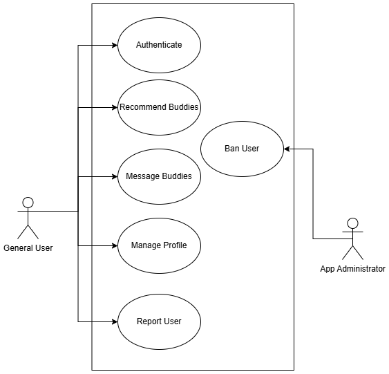
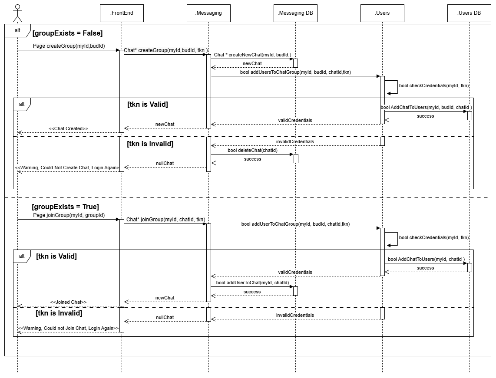
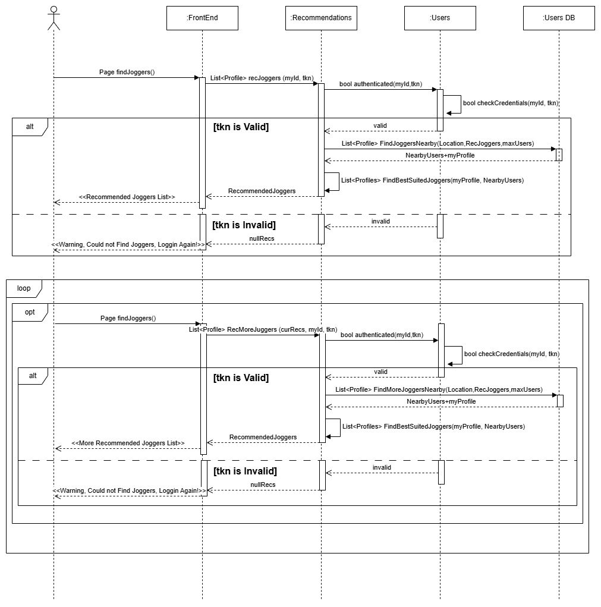
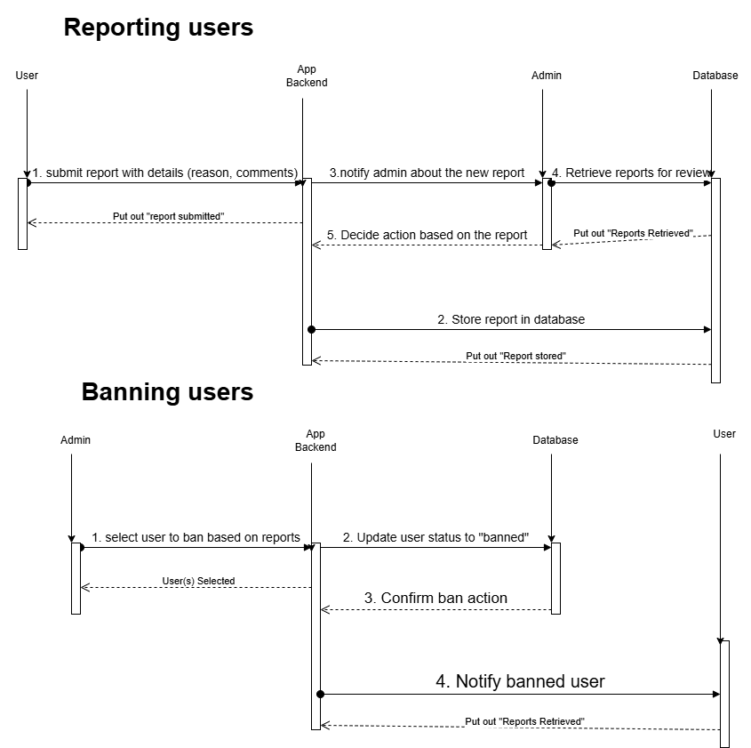

# M3 - Requirements and Design

## 1. Change History
<!-- Leave blank for M3 -->

## 2. Project Description
An application that connects nearby users to jog/run together adapting to their schedule and distance willing to travel. In addition, encouraging competitive joggers to thrive by hosting a leaderboard. 

## 3. Requirements Specification
### **3.1. Use-Case Diagram**


Login/Sign up -> Update profile - Amanvir
Report users - William
Ban Users (admin side) - William
Post and view leaderboard ranking - Vinny
Find jog buddies - use smart recommendation system - Vinny


### **3.2. Actors Description**
1. **User**: A person who uses the app to locate and connect with others users nearby, ultilizes leaderboards and update their personal information.
2. **App Admin**: A person who has higher privileges to moderate the app by reviewing reports from users and issues bans to offenders.

### **3.3. Functional Requirements**


1. **Reporting Users**<a id="fr1"></a>:
   - **Description**: Users can report inappropriate behavior or content within the app. This report is sent to the admin panel for further review.
   - **Primary actor(s)**: User
   - **Main success scenario**:
       1. User navigates to the profile or message thread of the offending user.
       2. User selects the "Report" option.
       3. User chooses a reason from a predefined list (e.g., harassment, spam, inappropriate content).
       4. User submits the report.
       5. System confirms submission and stores the report in the database.
       6. Admin is notified of the new report.
   - **Failure scenario(s)**:
       - 1a. No internet connection: Display "Failed to submit report. Please try again."
       - 1b. Report submission error: Display "An error occurred. Please try again later."

2. **Banning Users (Admin Side)**:
   - **Description**: Admins have the capability to ban users who have been reported for violations, ensuring a safe and friendly community environment.
   - **Primary actor(s)**: App Admin
   - **Main success scenario**:
       1. Admin logs into the admin panel.
       2. Admin reviews a list of reported users with details of the reports.
       3. Admin selects a user to ban.
       4. Admin clicks the "Ban User" button.
       5. System updates the user's status to "Banned" and restricts access to the app.
       6. User receives a notification or email explaining the reason for the ban.
   - **Failure scenario(s)**:
       - 1a. Database error: Display "Failed to ban user. Please try again later."
       - 1b. Unauthorized access: Display "You do not have permission to perform this action."
3. **Find Joggers Nearby**:
    - **Description**: This feature allows users to discover other joggers nearby based on their location and preferred jogging time.
    - **Primary actor(s)**: User
    - **Main success scenario**:
        1. User navigates to the "Find Joggers Nearby" section.
        2. User inputs their location and preferred jogging time.
        3. System retrieves and displays a list of available joggers nearby along with relevant details (e.g., name, experience level, jogging pace, availability).
    - **Failure scenario(s)**:
        - 3a. No suitable matches found: Display "No joggers available for the selected time and location. Please try again later or adjust your preferences."
        - 3b. Database error: Display "Unable to retrieve joggers. Please try again later."
        - 3c. Network issue: Display "Network error. Please check your internet connection and try again."
4. **Join/Create Chat Group**
    - **Description**: This feature allows users to join or create a chat group with other users when looking at the profile of other joggers.
    - **Primary Actors**: User(s)
    - **Main Success Scenario**:
        1. User clicks on an User Profile
        2. User sends a connection request or message to create a chat join a group chat with the jogger.
        3. If the jogger accepts, the system confirms the connection, allowing further communication.
    - **Failure Scenarios**:
    - 2a. User is not connected to the internet
5. **Login/Sign up -> Update profile**:
   - **Description**: This feature allows users to create an account or log in to an existing account on the app and update their profile to help personalize their nearby buddy recommendations
   - **Primary actor(s)**: User
   - **Main success scenario**:
       1. Successful Sign-Up
           - User submits sign up form, then the system creates an account in database and confirms with the user the sign up was successful
       2. Successful Login
           - User enters login credentials and system authenticates use, allowing user to access app and modify account
       3. Successfully saved profile changes
           - User modifies profile details and saves changes, system updates information in database and confirms the save was successful with user
   - **Failure scenario(s)**:
       1. Sign-Up Error
           - Email is already in system
           - Invalid email entered
           - Unable to connect to server
       2. Login Error
           - Invalid Credentials entered
           - Banned Account email entered
           - Email is not signed up for app
       3. Profile changes not saved
           - Invalid characters entered in profile details
           - Unable to connect to server, failure to save details
6. **Post and View Leaderboard Ranking**:
    - **Description**: This feature allows users to post and view leaderboard rankings based on their jogging performance.Users can compare their progress with others and motivate themselves to improve.
    - **Primary actor(s)**: User
    - **Main success scenario**:
        1. User navigates to the "Leaderboard" section.
        2. System retrieves and displays the leaderboard rankings based on jogging performance.
        3. User posts their latest jogging statistics (e.g., distance, time, pace).
        4. System updates the leaderboard and reflects the new ranking.
        5. User reviews their position on the leaderboard and compares with others.
    - **Failure scenario(s)**:
        - 3a. No leaderboard data available: Display "No rankings available at the moment. Start jogging and post your stats to see your ranking!"
        - 3b. Database error: Display "Unable to retrieve leaderboard rankings. Please try again later."
        - 3c. Network issue: Display "Network error. Please check your internet connection and try again."
        - 3d. Failed to post jogging stats: Display "Unable to post your jogging stats. Please check your input and try again."


### **3.4. Screen Mockups**


### **3.5. Non-Functional Requirements**
<a name="nfr1"></a>

1. **Location Accuracy** - Amanvir
    - **Description**: The location of the user must be given with an accuracy of <=20 meters.
    - **Justification**: Location Accuracy ensures users are only matched with other users within their specified connection radius and their distance traveled on runs is accurate. Inaccuracy can cause user disatifaction due to unfair leaderboard times and inaccurate partner locations.
2. **Security** - Vinny 
    - **TBA**: ...
    - **Encrypted**: ...
3. **Finding Buddies Performance** 
    - **Description**: The finding Buddies buddies functionality must respond with a list of nearby joggers in at most 15 seconds.
    - **Justification**: The finding application must be responsive and having customers wait for long periods of time negatively affetcts their experience as an user. Therefore, it is important to ensure that the most complex functionality is capped to a reasonable response time. To improve performance, when the functionality is taking too long, it might return the list with the remaining users  unsorted or return a shorter list of found users.

Security

Description: All user data and communications must be encrypted, and secure protocols (e.g., HTTPS) must be used.
Justification: Protect user privacy and prevent data breaches.


## 4. Designs Specification
### **4.1. Main Components** 
1. **User Management**
    - **Purpose**: Provide authentication, manage sessions, manage passwords, and ensure users can only access resources they have permission for. 
    - **Interfaces**: 
        1. Front-end form validation
            - **Purpose**: Provide authentication needed to start an user session.
        2. Back-end token management (JWT)
            -**Purpose**: Keep user session updated.
        3. Recommendation Engine:
            -**Purpose**: Handle the public data of other users that would be ideal to connect with the current user.
2. **Messaging** - Amanvir
    - **Purpose**: Allow users to communicate with potential jogging partners and discuss meeting time, place, etc.
    - **Interfaces**: 
        1. Node.js (Websocket library)
            - **Purpose**: Allows message exchange between users ensuring rapid communication
        2. MongoDB database
            - **Purpose**: Store chat history between users
3. **Recommended Jogging Partners** // Vinny
    - **Purpose**: Provide users with a list of potential jogging partners based on their preferences and location.
    - **Interfaces**: 
        1. ...
            - **Purpose**: ...
        2. ...
4. **Leaderboard** //William
    - **Purpose**:
    - **Interfaces**: 
        1. ...
            - **Purpose**: ...
        2. ...

Recommendation
Purpose: Match users with nearby jogging buddies based on preferences (e.g., schedule, distance).
Interfaces:
Database queries for user preferences
GPS location services for proximity calculations

Messages

### **4.2. Databases**
1. **Users DB**
    - **Purpose**: To store user credentials, preferences, and profiles.
2. **Messaging DB**
    - **Purpose**: To store chat logs and metadata.
3. **Leaderboard DB**
    - **Purpose**: To store user's running performance, and ranking.


### **4.3. External Modules**
1. **Google Map API** 
    - **Purpose**: To provide location services and map functionalities.
    

### **4.4. Frameworks**
1. **Microsoft Azure**
    - **Purpose**: ...
    - **Reason**: ...
2. ****
    - **Purpose**: ...
    - **Reason**: ...

### **4.5. Dependencies Diagram**


### **4.6. Functional Requirements Sequence Diagram**
1. [**Users can join/create a chat group of joggers**](#fr1)

2. [**Users can access a recommendation list of jogger profiles**](#fr2)

3. [**Users can report profiles and admin can ban profiles**](#fr2)



### **4.7. Non-Functional Requirements Design**
1. [**Location Accuracy: User Location should be accurate within 20 meters**](#nfr1)
    - **Validation**: Use simulated and real world testing to ensure the app only accepts location data within the threshold and provides a warning to the user when location accuracy is poor. Additionally we will log location data to make sure the error rate is <10%.
2. ...


### **4.8. Main Project Complexity Design**
**[WRITE_NAME_HERE]**
- **Description**: ...
- **Why complex?**: ...
- **Design**:
    - **Input**: ...
    - **Output**: ...
    - **Main computational logic**: ...
    - **Pseudo-code**: ...
        ```
        
        ```


## 5. Contributions
- Alfredo del Rayo:
  - Use-Case Diagram
  - Use-Case Description: 
    - Find Joggers Nearby and Create/Join Chat
    - Corresponding Sequence Diagram
  - Non functional Requirement:
    - Performance 
  - Main Component:
    - User Management
- 
- Amanvir Samra
  - Main Actors
  - Login Use Case Description
  - Non-functional requirement: Location Accuracy
  - Main Component: Messaging
  - Do corresponding sequence diagram for requirement
  - Do corresponding non-functional requirement
- Yu Qian Yi
  - Functional requirement: Post and view leaderboard ranking 
  - Functional requirement: Find jog buddies 
  - Database design & External modules description
  - Main component - Recommended Jogging Partners 
  - Do corresponding sequence diagram for requirement
  - Do corresponding sequence diagram non-functional requirement
- William Sun
  - Functional Requirements and sequence diagram (4.6)
    - reporting users
    - banning users
  - Main Components - Leaderboard
