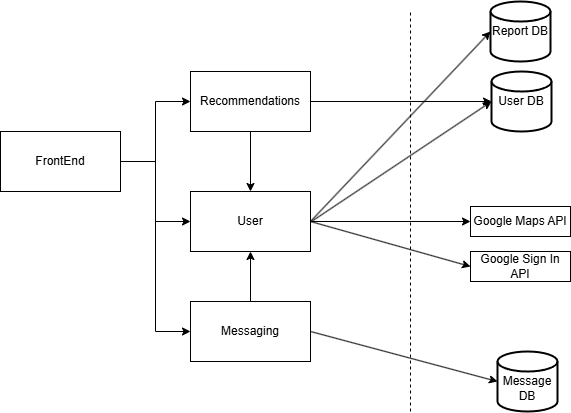
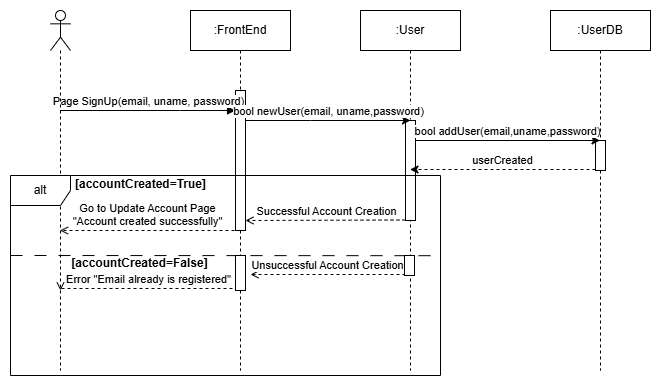
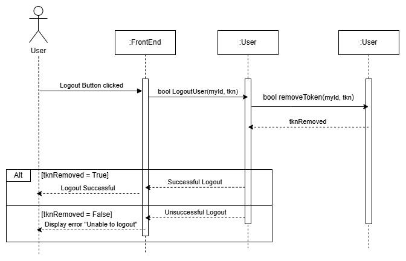
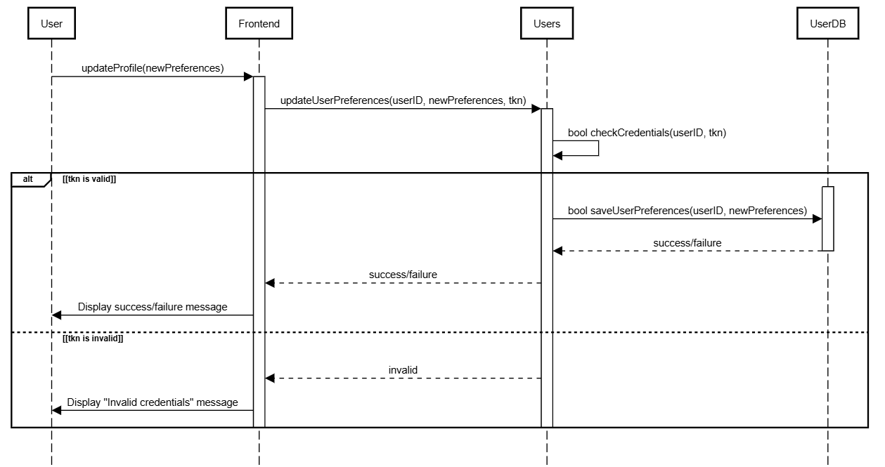
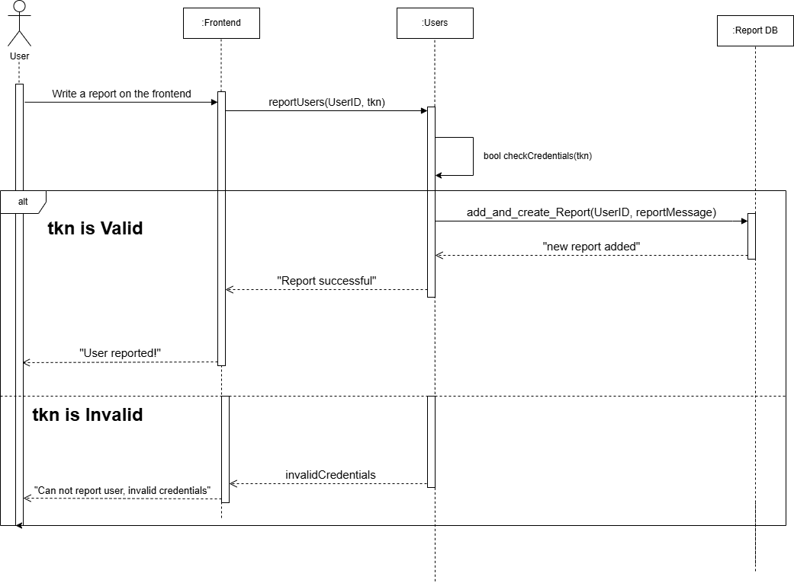

# M3 - Requirements and Design

## 1. Change History
<!-- Leave blank for M3 -->

## 2. Project Description
An application that connects nearby users to jog/run together adapting to their schedule and distance willing to travel.

## 3. Requirements Specification
### **3.1. Use-Case Diagram**


Authenticate -> Update profile - Amanvir
Find jog buddies - use smart recommendation system - Vinny
Message
Manage profile
Report users - William
Ban Users (admin side) - William


### **3.2. Actors Description**
1. **User**: A person who uses the app to locate and connect with others users nearby, ultilizes leaderboards and update their personal information.
2. **App Admin**: A person who has higher privileges to moderate the app by reviewing reports from users and issues bans to offenders.

### **3.3. Functional Requirements**

1. **User Authentication**:
   1. **Sign Up**:
        - **Description**: This feature allows users to create an account on the app using Google Sign In API.
        - **Primary actor(s)**: User
        - **Main success scenario**:
            - Successful Sign-Up
                - User submits sign up form, then the system creates an account in database and confirms with the user the sign up was successful
        - **Failure scenario(s)**:
            - Sign-Up Error
                - Invalid email entered
                - Unable to connect to server
    2. **Sign Up**:
        - **Description**: This feature allows users to log in to an existing account on the app using Google Sign In API.
        - **Primary actor(s)**: User
        - **Main success scenario**:
            - Successful Login
                - User enters login credentials and system authenticates use, creating a new session within the app
        - **Failure scenario(s)**:
            - Login Error
                - Invalid Credentials entered
    3. **Sign Out**:
        - **Description**: This feature allows users to log out from the app and close their current session.
        - **Primary actor(s)**: User
        - **Main success scenario**:
            - Successful Sign Out
                - User clicks sign out button, system uses User token to close user session and confirms with User once log out is successful
        - **Failure scenario(s)**:
            - Sign-Out Error
                - Unable to connect to server

2. **Update profile**:
   - **Description**: This feature allows users to update their profile to help personalize their nearby buddy recommendations.
   - **Primary actor(s)**: User
   - **Main success scenario**:
       1. User navigates to the profile section.
       2. User inputs their personal information and jogging preferences.
       3. User clicks on the "Save" button.
       4. System updates the user's profile in the database.
   - **Failure scenario(s)**:
       - 4a. Invalid input: Invalid characters entered in profile details.
       - 4b. Network issue: Display "Network error. Please check your internet connection and try again."

3. **Find Joggers Nearby**:
    - **Description**: This feature allows users to discover other joggers nearby based on their location and preferred jogging time.
    - **Primary actor(s)**: User
    - **Main success scenario**:
        1. User navigates to the "Find Joggers Nearby" section.
        2. User click on the "Find Joggers" button.
        3. System retrieves and displays a list of available joggers nearby along with relevant details (e.g., name, experience level, jogging pace, availability).
    - **Failure scenario(s)**:
        - 3a. No suitable matches found: Display "No joggers available for the selected time and location. Please try again later or adjust your preferences."
        - 3b. Database error: Display "Unable to retrieve joggers. Please try again later."
        - 3c. Network issue: Display "Network error. Please check your internet connection and try again."

4. **Join/Create Chat Group**
    - **Description**: This feature allows users to join or create a chat group with other users when looking at the profile of other joggers.
    - **Primary Actors**: User(s)
    - **Main Success Scenario**:
        1. User clicks on an User Profile
        2. User sends a connection request or message to create a chat or join a group chat with the jogger.
        3. If the jogger accepts, the system confirms the connection, allowing further communication.
    - **Failure Scenarios**:
    - 2a. Jogger/Group does not exist: Display "Error: Group/Jogger does not Exist"
    - 2b. User is not logged in: Display "Error: Please Log in again"
    - 3a. Jogger/Group Reports user attempting to join: "Error: Could not connect with Joggers"

5. **Reporting Users**<a id="fr1"></a>:
   - **Description**: Users can report inappropriate behavior or content within the app. This report is sent to the admin panel for further review.
   - **Primary actor(s)**: User
   - **Main success scenario**:
       1. User navigates to the profile or message thread of the offending user.
       2. User selects the "Report" option.
       3. User chooses a reason from a predefined list (e.g., harassment, spam, inappropriate content).
       4. User submits the report.
       5. System confirms submission and stores the report in the database.
       6. Admin is notified of the new report.
   - **Failure scenario(s)**:
       - 1a. No internet connection: Display "Failed to submit report. Please try again."
       - 1b. Report submission error: Display "An error occurred. Please try again later."

6. **Banning Users (Admin Side)**:
   - **Description**: Admins have the capability to ban users who have been reported for violations, ensuring a safe and friendly community environment.
   - **Primary actor(s)**: App Admin
   - **Main success scenario**:
       1. Admin logs into the admin panel.
       2. Admin reviews a list of reported users with details of the reports.
       3. Admin selects a user to ban.
       4. Admin clicks the "Ban User" button.
       5. System updates the user's status to "Banned" and restricts access to the app.
       6. User receives a notification or email explaining the reason for the ban.
   - **Failure scenario(s)**:
       - 1a. Database error: Display "Failed to ban user. Please try again later."
       - 1b. Unauthorized access: Display "You do not have permission to perform this action."


### **3.4. Screen Mockups**


### **3.5. Non-Functional Requirements**
<a name="nfr1"></a>

1. **Security**  
    - **Description**: The application will ensure that user data and communications are encrypted, and secure protocols (e.g., HTTPS) will be used.
    - **Justification**: Security is a key aspect of any application that handles user data. It ensures that users' personal information is protected from unauthorized access and potential breaches. This is crucial for building trust and maintaining user confidence in the application.
2. **Finding Buddies Performance** 
    - **Description**: The finding Buddies buddies functionality must respond with a list of nearby joggers in at most 15 seconds.
    - **Justification**: The finding application must be responsive and having customers wait for long periods of time negatively affetcts their experience as an user. Therefore, it is important to ensure that the most complex functionality is capped to a reasonable response time. To improve performance, when the functionality is taking too long, it might return the list with the remaining users  unsorted or return a shorter list of found users.


## 4. Designs Specification
The design focuses on enabling the general user to
### **4.1. Main Components** 
1. **Users**
    - **Purpose**: Provide authentication, manage sessions, manage passwords, and ensure users can only access resources they have permission for. 
    - **Interfaces**: 
        1. Front-end form validation
            - **Purpose**: Provide authentication needed to start an user session.
        2. Back-end token management (JWT)
            -**Purpose**: Keep user session updated.
        3. Recommendation Engine:
            -**Purpose**: Handle the public data of other users that would be ideal to connect with the current user.
2. **Messaging** - Amanvir
    - **Purpose**: Allow users to communicate with potential jogging partners and discuss meeting time, place, etc.
    - **Interfaces**: 
        1. Node.js (Websocket library)
            - **Purpose**: Allows message exchange between users ensuring rapid communication
        2. MongoDB database
            - **Purpose**: Store chat history between users
3. **Recommendations** 
    - **Purpose**: Provide users with a list of potential jogging partners based on their preferences and location.
    - **Interfaces**: 
        1. **`boolean authenticated(String userId, String tkn)`**
        - **Purpose**: Validates the user’s authentication token before processing their request.

        2. **`List<Profile> findJoggersNearby(Location location, double maxUsers)`**
        - **Purpose**: Retrieves joggers located within a specified distance from the user.

        3. **`List<Profile> findBestSuitedJoggers(UserProfile profile, List<Profile> nearbyUsers)`**
        - **Purpose**: Applies a matching algorithm to rank and return the most compatible jogger profiles for the user.

Recommendation
Purpose: Match users with nearby jogging buddies based on preferences (e.g., schedule, distance).
Interfaces:
Database queries for user preferences
GPS location services for proximity calculations

Messages

### **4.2. Databases**
1. **Users DB**
    - **Purpose**: To store user credentials, running preferences, and running performance.
2. **Messaging DB**
    - **Purpose**: To store chat logs and metadata.


### **4.3. External Modules**
1. **Google Sign in API** 
    - **Purpose**: To provide user authentication service.
1. **Google Map API** 
    - **Purpose**: To provide location services and map functionalities.
    

### **4.4. Frameworks**
1. **Microsoft Azure**
    - **Purpose**: It is our cloud provider, used to host our server.
    - **Reason**: We want to experiment with it and learn about using it as usually it costs a lot of money but we have access to it for free.
2. **MongoDB**
    - **Purpose**: It will be used for our all of our databases
    - **Reason**: It is dynamic and always you to retrieve objects as JSON, additionally MongoDB has better performance than most other database options we have access to.
2. **ExpressJS**
    - **Purpose**: We will use it to build RESTful APIs
    - **Reason**: It allows us to easily and rapidly set up a REST API. Also it is lightweight and works with MongoDB,

### **4.5. Dependencies Diagram**


### **4.6. Functional Requirements Sequence Diagram**
1. [**User Login/Sign up**](#fr5)



2. [**User Sign out**](#fr5)



3. [**Update Profile**](#fr5)



4. [**Recommend Jogging Buddies**](#fr2)


5. [**Users can join/create a chat group of joggers**](#fr1)


6. [**Users can report profiles**](#fr2)



7. [**Admin can ban profiles**](#fr2)


### **4.7. Non-Functional Requirements Design**
1. [**Security: Encryption of user data**](#nfr1)
    - **Validation**: All user data and communications will be encrypted using HTTPS to ensure secure data transmission. Passwords will be securely hashed before storage, and database encryption will be applied for sensitive information. 
2. [**Performance: Find Buddies Does must not take more than 15s**](#nfr2)
    - **Validation**: The time algorithm  for finding buddies will be capped to 12 seconds and will be constrained to selecting at most ten profiles from a list of at most 100 users. In addition, the front end will have a timer and return failure if no response is received by those 15 seconds. This will ensure that in case of losing connection, there is a timeout for reconnection attempts.


### **4.8. Main Project Complexity Design**
**[WRITE_NAME_HERE]**
- **Description**: The jogger recommendation system helps users find compatible running partners based on location, jogging speed, and preferred running time. The system processes user profiles and ranks potential jogging buddies using a weighted scoring mechanism. The recommendation process needs to be efficient, scalable, and provide relevant matches in real-time.

- **Why complex?**: 
    - Geospatial Calculations: The system must compute distances between users using latitude and longitude, requiring efficient algorithms like the Haversine formula.
    - Multi-Factor Matching: Users are not just matched based on distance but also jogging speed and time compatibility, requiring multi-variable optimization.
    - Efficient Sorting & Filtering: Since the system might need to process thousands of users, ranking and filtering must be optimized.
    - Scalability: As more users join, the system must handle increased computations without degrading performance.

- **Design**:
    - **Input**: 
        - ShortListedBuddies: List of user profiles filtered by basic constraints (e.g., active users, within a certain radius).
        - UserLocation: The latitude and longitude of the user.
        - UserAvaliability: A schedule that shows times the user is available throughout the week.
        - UserSpeed: The user’s average jogging speed.
    - **Output**: 
        - A list of the top 5 best-matched jog buddies, ranked based on a computed match score.
    - **Main computational logic**: 
        - Distance Calculation: Uses the Haversine formula to compute the real-world distance between the user and each buddy.
        - Time and Speed Compatibility: Calculates the absolute difference in preferred jogging time and speed.
        - Scoring System: Assigns weighted scores based on proximity, time similarity, and speed similarity.
        - Sorting and Selection: Ranks the top 5 most compatible jogging partners.

    - **Pseudo-code**: 

```
Algorithm findJogBuddies(ShortListedBuddies, userLocation, userAvailability, userSpeed)
    Input: 
        ShortListedBuddies (List of profiles)
        userLocation (latitude, longitude)
        userAvailability
        userSpeed
    Output: 
        Top 5 best-matched jog buddies

    Define matches as an empty list

    For each buddy in ShortListedBuddies:
        Calculate distanceScore = calculateDistance(userLocation, buddy.location)
        Calculate timeDifference = abs(userAvailability - buddy.Availability)
        Calculate speedDifference = abs(userSpeed - buddy.speed)

        If timeDifference ≤ thresholdTime AND speedDifference ≤ thresholdSpeed:
            Compute matchScore = (1 / (1 + distanceScore)) * weightLocation + 
                                (1 / (1 + timeDifference)) * weightTime + 
                                (1 / (1 + speedDifference)) * weightSpeed

            Add (buddy, matchScore) to matches list

    Sort matches in descending order by matchScore

    Return top 5 buddies from matches (if available)
End Algorithm

Function calculateDistance(location1, location2)
    Input: 
        location1 (lat1, lon1)
        location2 (lat2, lon2)
    Output: 
        Distance between two locations in km

    Apply Haversine Formula:
        R = 6371 (Earth’s radius in km)
        dLat = toRadians(lat2 - lat1)
        dLon = toRadians(lon2 - lon1)

        a = sin²(dLat / 2) + cos(toRadians(lat1)) * cos(toRadians(lat2)) * sin²(dLon / 2)
        c = 2 * atan2(sqrt(a), sqrt(1-a))

    Return R * c
End Function
```


## 5. Contributions
- Alfredo del Rayo:
  - Use-Case Diagram
  - Use-Case Description: 
    - Find Joggers Nearby and Create/Join Chat
    - Corresponding Sequence Diagram
  - Non functional Requirement:
    - Performance 
  - Main Component:
    - User Management
- Amanvir Samra
  - Main Actors
  - Login Use Case Description
  - Non-functional requirement: Location Accuracy
  - Main Component: Messaging
  - Do corresponding sequence diagram for requirement
  - Do corresponding non-functional requirement
- Yu Qian Yi
  - Functional requirement: Update Profile & Find Joggers Nearby 
  - Database design & External modules description
  - Main component - Recommendation
  - Do corresponding sequence diagram for requirement
  - Do corresponding sequence diagram non-functional requirement
  - Pseudocode 
- William Sun
  - Functional Requirements and sequence diagram (4.6)
    - reporting users
    - banning users
  - Main Components - Leaderboard
  - 4.8
