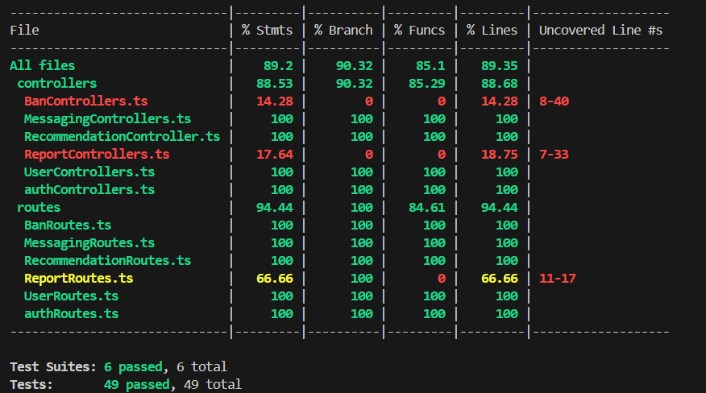
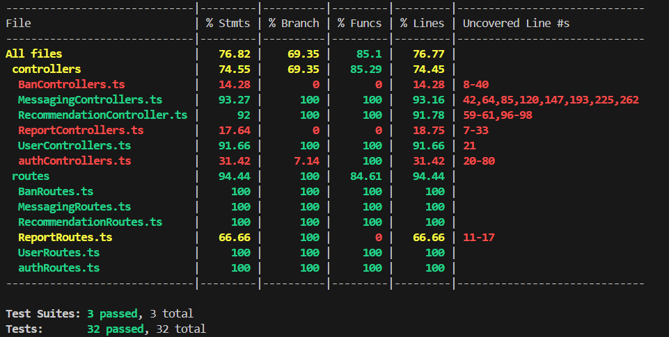

# Example M5: Testing and Code Review

## 1. Change History

| **Change Date**   | **Modified Sections** | **Rationale** |
| ----------------- | --------------------- | ------------- |
| _Nothing to show_ |

---

## 2. Back-end Test Specification: APIs

### 2.1. Locations of Back-end Tests and Instructions to Run Them
All Backend Tests are located under  `backend/tests`

We assume that you have MongoDB installed and running in your machine.

First cd into the backend directory, and create an .env file with the following properties:
```
DB_URI: mongodb://localhost:27017/tests
PORT: 3000
GOOGLE_CLIENT_ID: << Your GOOGLE CLIENT ID >> 
JWT_SECRET: helloWorld
IS_TESTING: true
```
Make sure to replace << Your GOOGLE CLIENT ID >> with your own google OAuth web client ID. Then to start the test run the following commands:
```sh
npx ts-jest config:init
npm test
```

#### 2.1.1. Tests

| **Interface**                 | **Describe Group Location, No Mocks**                | **Describe Group Location, With Mocks**            | **Mocked Components**              |
| ----------------------------- | ---------------------------------------------------- | -------------------------------------------------- | ---------------------------------- |
| **POST /user/login**          | [`tests/unmocked/authenticationLogin.test.js#L1`](#) | [`tests/mocked/authenticationLogin.test.js#L1`](#) | Google Authentication API, User DB |
| **POST /study-groups/create** | ...                                                  | ...                                                | Study Group DB                     |
| ...                           | ...                                                  | ...                                                | ...                                |
| ...                           | ...                                                  | ...                                                | ...                                |
| GET /chat/:email |
| GET /chat/
#### 2.1.2. Commit Hash Where Tests Run

#### 2.1.3. Explanation on How to Run the Tests

1. **Clone the Repository**:

   - Open your terminal and run:
     ```
     git clone https://github.com/example/your-project.git
     ```

2. **...**

### 2.2. GitHub Actions Configuration Location

`.github/workflows/backendTests.yml`

### 2.3. Jest Coverage Report Screenshots With Mocks



### 2.4. Jest Coverage Report Screenshots Without Mocks



---

## 3. Back-end Test Specification: Tests of Non-Functional Requirements

### 3.1. Test Locations in Git

| **Non-Functional Requirement**  | **Location in Git**                              |
| ------------------------------- | ------------------------------------------------ |
| **Performance (Response Time)** | [`tests/nonfunctional/response_time.test.js`](#) |
| **Chat Data Security**          | [`tests/nonfunctional/chat_security.test.js`](#) |

### 3.2. Test Verification and Logs

- **Performance (Response Time)**

  - **Verification:** This test suite simulates multiple concurrent API calls using Jest along with a load-testing utility to mimic real-world user behavior. The focus is on key endpoints such as user login and study group search to ensure that each call completes within the target response time of 2 seconds under normal load. The test logs capture metrics such as average response time, maximum response time, and error rates. These logs are then analyzed to identify any performance bottlenecks, ensuring the system can handle expected traffic without degradation in user experience.
  - **Log Output**
    ```
    [Placeholder for response time test logs]
    ```

- **Chat Data Security**
  - **Verification:** ...
  - **Log Output**
    ```
    [Placeholder for chat security test logs]
    ```

---

## 4. Front-end Test Specification

### 4.1. Location in Git of Front-end Test Suite:

`frontend/src/androidTest/java/com/studygroupfinder/`

### 4.2. Tests

- **Use Case: Login**

  - **Expected Behaviors:**
    | **Scenario Steps** | **Test Case Steps** |
    | ------------------ | ------------------- |
    | 1. The user opens “Add Todo Items” screen. | Open “Add Todo Items” screen. |
    | 2. The app shows an input text field and an “Add” button. The add button is disabled. | Check that the text field is present on screen.<br>Check that the button labelled “Add” is present on screen.<br>Check that the “Add” button is disabled. |
    | 3a. The user inputs an ill-formatted string. | Input “_^_^^OQ#$” in the text field. |
    | 3a1. The app displays an error message prompting the user for the expected format. | Check that a dialog is opened with the text: “Please use only alphanumeric characters”. |
    | 3. The user inputs a new item for the list and the add button becomes enabled. | Input “buy milk” in the text field.<br>Check that the button labelled “add” is enabled. |
    | 4. The user presses the “Add” button. | Click the button labelled “add”. |
    | 5. The screen refreshes and the new item is at the bottom of the todo list. | Check that a text box with the text “buy milk” is present on screen.<br>Input “buy chocolate” in the text field.<br>Click the button labelled “add”.<br>Check that two text boxes are present on the screen with “buy milk” on top and “buy chocolate” at the bottom. |
    | 5a. The list exceeds the maximum todo-list size. | Repeat steps 3 to 5 ten times.<br>Check that a dialog is opened with the text: “You have too many items, try completing one first”. |

  - **Test Logs:**
    ```
    [Placeholder for Espresso test execution logs]
    ```

- **Use Case: ...**

  - **Expected Behaviors:**

    | **Scenario Steps** | **Test Case Steps** |
    | ------------------ | ------------------- |
    | ...                | ...                 |

  - **Test Logs:**
    ```
    [Placeholder for Espresso test execution logs]
    ```

- **...**

---

## 5. Automated Code Review Results

### 5.1. Commit Hash Where Codacy Ran

`[Insert Commit SHA here]`

### 5.2. Unfixed Issues per Codacy Category

_(Placeholder for screenshots of Codacy’s Category Breakdown table in Overview)_

### 5.3. Unfixed Issues per Codacy Code Pattern

_(Placeholder for screenshots of Codacy’s Issues page)_

### 5.4. Justifications for Unfixed Issues

- **Code Pattern: [Usage of Deprecated Modules](#)**

  1. **Issue**

     - **Location in Git:** [`src/services/chatService.js#L31`](#)
     - **Justification:** ...

  2. ...

- ...